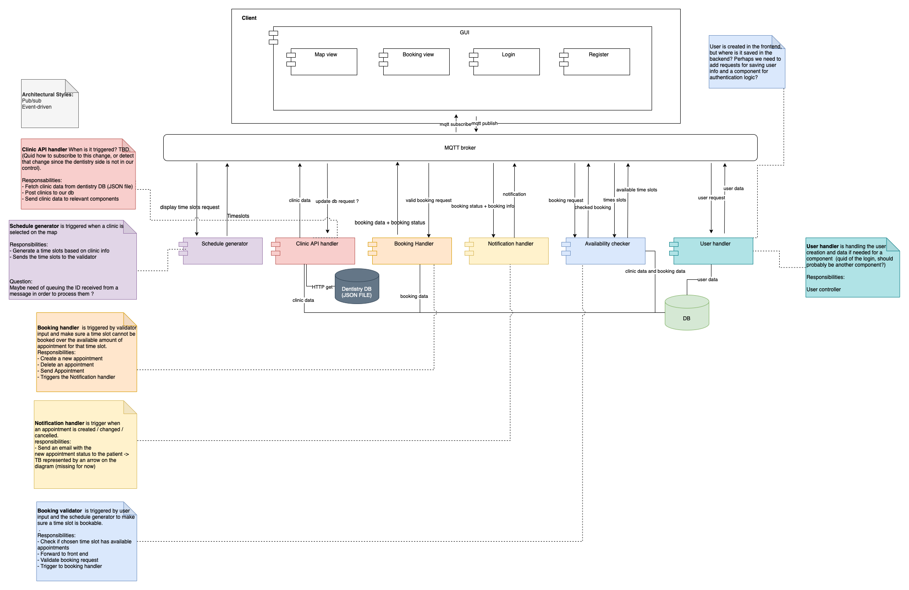

# Booking Handler

## Description

This component is part of the the distributed system DENTISTIMO, a web application that offers a geolocalisation based dental care booking system.
The booking handler takes care of requests regarding bookings. More details can be found in the component diagram below as well as further in this README.md file. 

## System Architecture - Component Diagram

> 

## Component Responsibilities

- Listen to MQQT broker for booking data from front end
- Save booking to database
- Delete one booking from database
- Publish outcome of data maniuplation via mqtt

## Data input and output
### Data input

The component expects stringified json objects sent via MQTT. 

The json objects should have at least these information for the following tasks:
- Save a new booking: a json object following the booking schema: 

<b>example</b>

    {   "name": "Peter",
    "userID": {"$oid": "61a63f2b8a42f95c0b120a5a"},
    "clinicID": {"$oid": "61a63f2b8a42f95c0b120a5a"},
    "date": "23/12/2019",
    "startTime": "9:00",
    "endTime": "8:00",
    }

- Delete a booking: the booking database id
- Retrieve a booking from the database: the booking database id
- Retreive all bookings of a given customer: the customer database id 

<b>example</b>

    { "_id": {
            "$oid": "61a63f2b8a42f95c0b120a5a"
            },
        ...
    }

### Data output

The component sends stringified json objects.
The format varies based on the request:

- Save a new booking: a stringified json object of the saved booking data: 
- Delete a booking: a stringified json object of the deleted booking data
- Retrieve a booking from the database: a stringified json object of the saved booking data
- Retreive all bookings of a given customer: a collection of  stringified json objects having of a same customer 

## Installing and running

### Prerequisits:
#### MQTT
You need to have a running version of <b>MQTT</b> on your machine. Please refer to this [link](https://www.google.com/url?sa=t&rct=j&q=&esrc=s&source=web&cd=&ved=2ahUKEwjG3fWb6NH0AhXpQvEDHSGLC2MQFnoECAMQAQ&url=https%3A%2F%2Fmosquitto.org%2Fdownload%2F&usg=AOvVaw2rLN-Os_zfUrtqeV1Lrunf) to download the mosquitto broker if you do not have any. 
#### Node.js
To download the latest version of node.js, please follow this [link](https://nodejs.org/en/download/)

### Instructions

| Step | Command |
| ------ | ------ |
| start your MQTT broker on port 1883| This differs based on which broker, as well as your settings. Make sure the broker listens to port 1883. (Default port with mosquitto) |
| clone this project on your machine | `git clone < SSH address or HTTPS address >` |
| go to the repo and run the following  | `npm start` |

In the window of your broker, you should see a message similar to this:

`1638885841: New client connected from 127.0.0.1:49531 as Dentistimo Team5 - Booking Handler n°3c1ff99e (p2, c1, k60).`

The booking handler is now ready to proceed your requests. 
